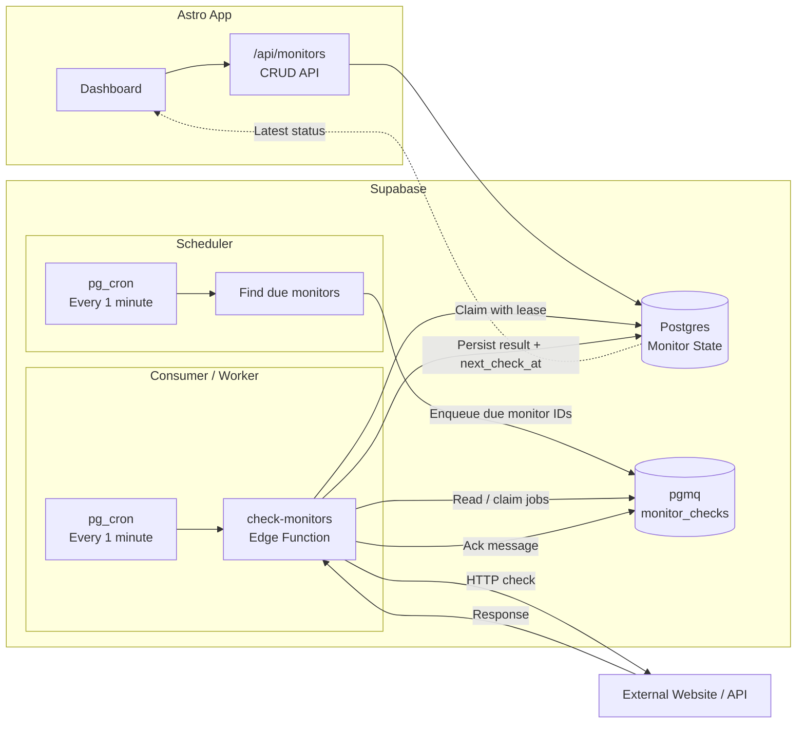

# Aliv-e

A simple uptime monitoring tool that checks whether your websites and APIs are up or down. You add a monitor with a URL and a schedule. The system fetches that URL on time, records the result, and shows you the latest status.

Built with **Astro** (front-end + API) and **Supabase** (Postgres, Edge Functions, pg_cron, pgmq). It runs on the free tier and has no extra services to pay for.

> [!NOTE]
> This project stores only the **latest state** of each monitor. It does not keep a history of every check.

---

## What's in it for you

- Track many URLs from one dashboard.
- Choose how often each one is checked (every 10 to 60 minutes).
- See live **UP / DOWN / PENDING** status, response time, and the last error.
- Pause and resume any monitor without deleting it.
- Checks are scheduled automatically — you do nothing after you create a monitor.

---

## How it works

Here is the flow when you add a monitor:

1. You create a monitor through the API or the dashboard.
2. A **scheduler** runs every minute. It finds monitors that are due for a check and puts their IDs into a queue.
3. A **worker** (a Supabase Edge Function) drains that queue. It fetches each URL, follows redirects, and saves the result.
4. The dashboard shows the newest status for every monitor.



Two cron jobs fire every minute:

- **Scheduler** — pure SQL. Finds due monitors and enqueues their IDs. It does no fetching, so it runs fast.
- **Consumer** — calls the `check-monitors` Edge Function. This one does the actual HTTP checks.

Because the scheduler and the worker are separate, one slow check never blocks the next scheduling round.

---

## Project layout

```text
├── src/                 # Astro app
│   ├── components/      # UI pieces (monitor cards, forms, badges)
│   ├── layouts/         # Page layout wrapper
│   ├── lib/             # Request + error helpers for the API
│   ├── pages/           # Routes (landing, dashboard + /api/monitors endpoints)
│   └── styles/          # Global CSS
├── public/              # Static files (favicons, web manifest, local Array/Khand fonts)
├── shared/              # Code used by both the app and the API
│   ├── schemas.ts       # Zod validation for create/update inputs
│   ├── env.ts           # Validates required environment variables
│   ├── logger.ts        # Small structured logger
│   ├── ssrf.ts          # Node-side SSRF URL guard
│   └── monitor-limit.ts # Per-user monitor cap + error
├── supabase/
│   ├── db/              # Database boundary (monitors CRUD)
│   ├── functions/
│   │   ├── check-monitors/  # The worker Edge Function
│   │   └── _shared/         # Worker-only code (check + SSRF)
│   └── migrations/      # SQL schema + scheduler + queue setup
└── .env.example         # Template for required environment variables
```

Unusual top-level files:

- `schema / migrations` — all database changes live under `supabase/migrations/`.
- `shared/` — imported by both the browser build and the server API routes, so it must stay dependency-light.
- `supabase/functions/` — Deno code (the Edge Function). It is **not** part of the Astro TypeScript project and is excluded from `pnpm check`.

---

## Architecture decisions

These are the main choices behind the design and why they were made.

**pgmq over an external queue (SQS / Kafka).**
pgmq is a Postgres-native queue that ships with Supabase. It adds no new service and no cost, and it is plenty for this scale. An external queue solves a scaling problem this project does not have.

**Scheduler / worker split.**
The scheduling tick (find due monitors, enqueue) and the execution (fetch URLs) run in separate steps. This keeps the scheduling query cheap and fast, and it means a batch of slow checks can never delay the next scheduling round.

**Atomic claim with a lease.**
When the worker picks up a monitor, it claims it with a single `UPDATE`. That claim sets a lease expiry. If two workers try to check the same monitor at once, only one wins. The other sees the lease and skips. This prevents double-checking without fragile compare-and-set logic.

**SSRF guard at both the API and the worker.**
A monitor URL must resolve only to public IPs. We reject URLs that point to private, loopback, link-local, or cloud-metadata addresses (for example `127.0.0.1` or `169.254.169.254`). We check this once when you create or edit a monitor, and again at fetch time, including every redirect hop. This stops a user from making the system fetch internal resources.

**Per-user monitor cap.**
Each user can create up to 20 monitors. The API checks the count before insert, and a database trigger enforces it too, so the limit holds even under concurrent requests.

**No auth in V1 (by decision).**
Monitors are tied to a username that the client supplies; there is no session and no row-level security. Anyone who knows a username can read or edit that user's monitors. This is a known gap and was a deliberate choice while the tool is single-user. See **Roadmap**.

---

## Roadmap (future features)

These are planned or considered but not built yet.

- **Auth and ownership (RLS).** Add Supabase Auth and row-level security so each user can only see and edit their own monitors. This is the biggest remaining item.
- **Debounce before DOWN.** Only mark a monitor DOWN after two failed checks in a row, to avoid flapping on one short outage.
- **Uptime history.** Save every check to a log table so you can show uptime percentage over time.
- **Alerting.** Send email, webhook, or Slack notifications when a monitor goes DOWN.
- **Multi-region checks.** Check a URL from more than one place for better accuracy.

Explicitly out of scope for now: an external queue and a horizontally scaled worker fleet.

---

## Requirements

- **Node.js** (18+) and **pnpm**
- **Deno** (to run the Edge Function locally)
- **Supabase CLI** (to push migrations and deploy the function)
- A **Supabase project** (cloud or local)

---

## Getting started

### 1. Install dependencies

```bash
pnpm install
```

### 2. Set up environment variables

Copy the example file and fill in real values:

```bash
cp .env.example .env
```

Open `.env` and replace the placeholders:

| Variable | What it is | Where from |
|---|---|---|
| `SUPABASE_URL` | Your project's API URL | Supabase dashboard → Settings → API |
| `SUPABASE_ANON_KEY` | Safe, browser-side key | Same page |
| `SUPABASE_SERVICE_ROLE_KEY` | Server-only key (never ship it) | Same page |
| `WORKER_SECRET` | A random secret shared with the worker | You create this |

> [!WARNING]
> Never commit real keys. `.env` is in `.gitignore`. Only `.env.example` is tracked.

### 3. Apply the database schema

Push the migrations to your Supabase project:

```bash
supabase db push
```

Or, for a fully local setup:

```bash
supabase init
supabase start
supabase db reset
```

### 4. Deploy the worker (Edge Function)

```bash
supabase functions deploy check-monitors
```

The worker needs these secrets set on the project:

```bash
supabase secrets set SUPABASE_URL=... SUPABASE_SERVICE_ROLE_KEY=... WORKER_SECRET=...
```

The cron job that invokes the worker authenticates with a bearer token stored in Supabase **Vault** under the name `worker_secret`. Set that secret to the same value as `WORKER_SECRET`.

> [!TIP]
> The scheduler and consumer cron schedules are created by the migrations. If you change a check interval or the timeout cap, revisit the queue sizing together (visibility timeout, batch size, concurrency) — don't tune one without the others.

### 5. Run the app

Local development:

```bash
pnpm dev
```

Open the dashboard at `http://localhost:4321/dashboard/<username>`.

Production build and preview:

```bash
pnpm build
pnpm preview
```

---

## Scripts

| Command | What it does |
|---|---|
| `pnpm dev` | Start the Astro dev server |
| `pnpm build` | Build the app for production |
| `pnpm preview` | Preview a production build |
| `pnpm check` | Type-check the Astro project |
| `pnpm biome:check` | Lint and format-check the project |

---

## Using the API

The CRUD endpoints live under `/api/monitors`.

| Method | Path | Purpose |
|---|---|---|
| `POST` | `/api/monitors` | Create a monitor |
| `GET` | `/api/monitors?username=...` | List a user's monitors |
| `PATCH` | `/api/monitors/:id` | Update a monitor (rename, edit URL, change interval/timeout, pause / resume) |
| `DELETE` | `/api/monitors/:id` | Delete a monitor |

Check intervals: `10, 14, 15, 20, 30, 45, 60` minutes.
Timeouts: `1, 5, 10, 15, 20, 30, 45, 60` seconds.
URLs must be `http` or `https` and must resolve to public IPs only.
Usernames run 3–10 chars: lowercase letters, numbers, `_` or `-`.

---

## Contributing

Contributions are welcome. To keep the code consistent:

- Make sure `pnpm check`, `pnpm build`, and `pnpm biome:check` all pass.
- The worker in `supabase/functions/` is Deno. It is not covered by the Astro checks, so run `deno check` and `deno test` there separately (see `supabase/functions/check-monitors/check-monitors.test.ts`).
- Keep shared utility code in `shared/` small and dependency-free.

---

## License

Not yet specified.
